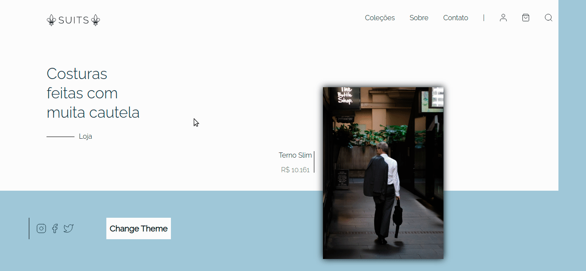

<h1 align=center>UI Figma clones</h1>
<p align=center> Created by: <a href="https://www.linkedin.com/in/andrei-muniz-0331ab193/">Andrei Muniz</a></p>
<p align=center>Done with: Next.js Typescript Styled-components</p>
<h1 align=center>Start project</h1>

```bash
# Run on terminal
git clone https://github.com/mfortunat0/Figma-clones

cd Figma-clones

# For yarn
yarn && yarn dev

# For npm
npm install && npm run dev
```

Acess <a href="http://localhost:3000/"> localhost:3000</a>

<h1 align=center>Previews</h1>
<p align=center></p>
<br />
<p align=center></p>
